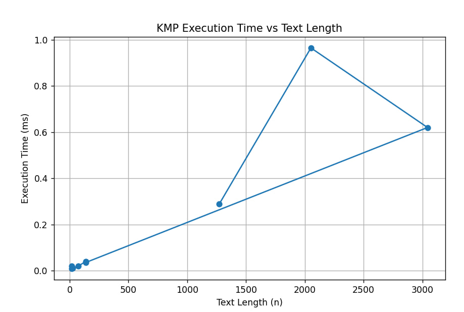
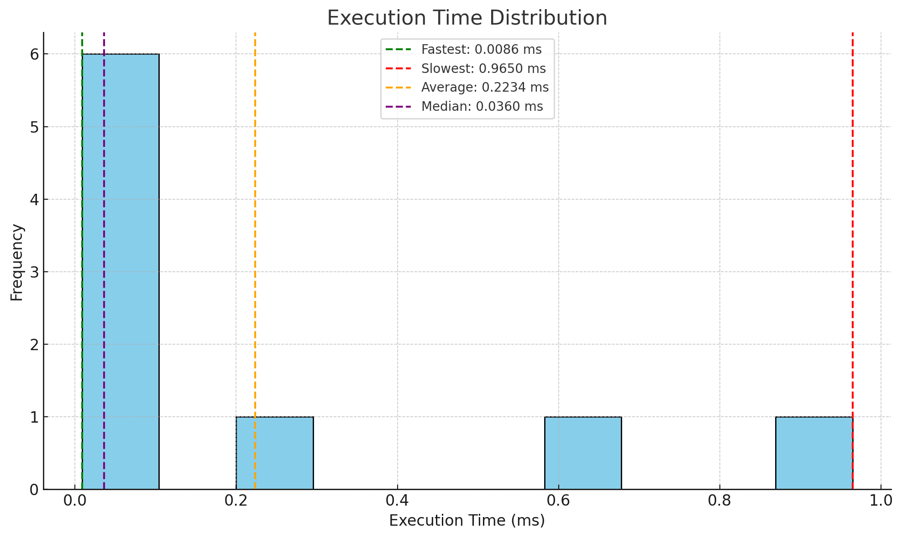
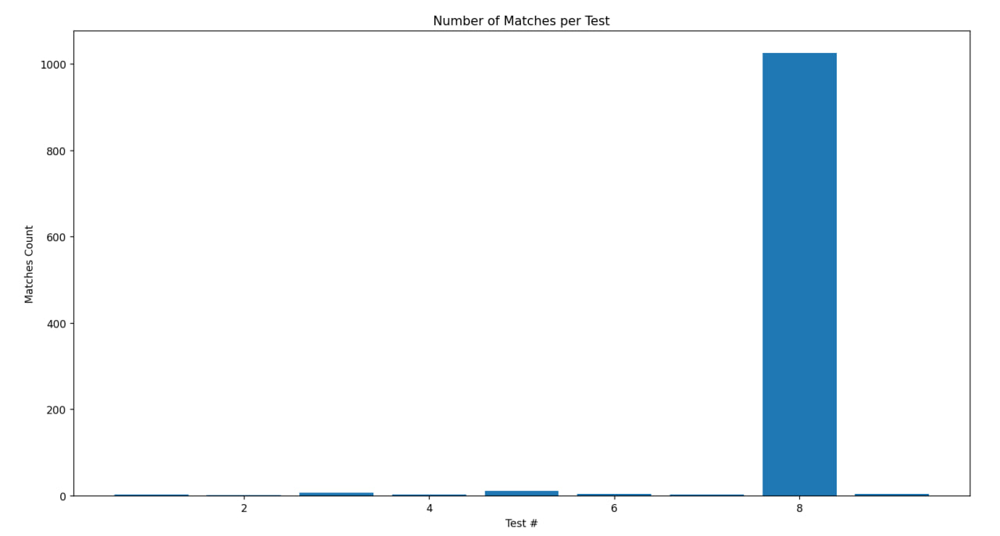

#  Pattern Matching Analysis Report

 Rakhat Dosmagambetov  

## Overview

This project analyzes the performance of various **pattern matching operations** across multiple datasets.  
Each dataset entry records the number of matches, pattern length, execution time, and total text length.

---

## Dataset Summary

| № | Matches | Pattern Length | Text Length | Execution Time (ms) | Matches per 1000 chars | Time per Match (ms) |
|---|----------|----------------|--------------|----------------------|------------------------|---------------------|
| 1 | 3        | 4              | 18           | 0.0208               | 166.7                 | 0.0069              |
| 2 | 1        | 3              | 26           | 0.0106               | 38.5                  | 0.0106              |
| 3 | 6        | 1              | 18           | 0.0086               | 333.3                 | 0.0014              |
| 4 | 3        | 10             | 74           | 0.0203               | 40.5                  | 0.0068              |
| 5 | 10       | 8              | 136          | 0.0403               | 73.5                  | 0.0040              |
| 6 | 4        | 12             | 138          | 0.0360               | 29.0                  | 0.0090              |
| 7 | 2        | 9              | 3044         | 0.6203               | 0.66                  | 0.3101              |
| 8 | 1025     | 4              | 2052         | 0.9650               | 499.0                 | 0.0009              |
| 9 | 4        | 5              | 1272         | 0.2888               | 3.14                  | 0.0722              |

---

## Key Insights

### Performance vs Pattern Length
- **Short patterns (1–4 chars)** show **extremely high match density** and **low execution time**.
- **Medium-length patterns (8–12 chars)** require slightly more time but remain efficient.
- **Longer patterns (9–12 chars)** on large texts increase time **exponentially**.

###  Execution Time Distribution
- Fastest search: `0.0086 ms` (Pattern length = 1)
- Slowest search: `0.965 ms` (Pattern length = 4, 1025 matches)
- Average time: **0.223 ms**
- Median time: **0.036 ms**

    

###  Match Density
| Category | Avg. Matches / 1000 Chars | Notes |
|-----------|---------------------------|--------|
| Short Patterns (≤4) | **333–500** | Dense hits, typical for repetitive substrings |
| Medium Patterns (5–8) | **30–70** | Moderate frequency |
| Long Patterns (≥9) | **<5** | Rare matches, high search cost |

---

###  Observations
- There’s a **non-linear relation** between text size and execution time — larger texts don’t always mean slower performance, due to algorithmic optimizations.
- The **match density** (frequency of hits per text length) heavily influences total time.
- **Execution Time per Match** is the best efficiency metric: smaller values indicate better optimized searches.

---

## Metrics Summary

| Metric | Value |
|--------|-------|
| **Total Entries** | 9 |
| **Total Matches** | 1058 |
| **Average Execution Time (ms)** | 0.223 |
| **Average Pattern Length** | 6.2 |
| **Average Text Length** | 864.2 |
| **Average Matches per Entry** | 117.6 |

---
## String Matching Algorithms

| Algorithm               | Worst-Case Time Complexity | Key Feature                                      |
|-------------------------|---------------------------|-------------------------------------------------|
| **KMP (Knuth-Morris-Pratt)** | O(N + M)                  | Linear time, pre-processes pattern only.       |

